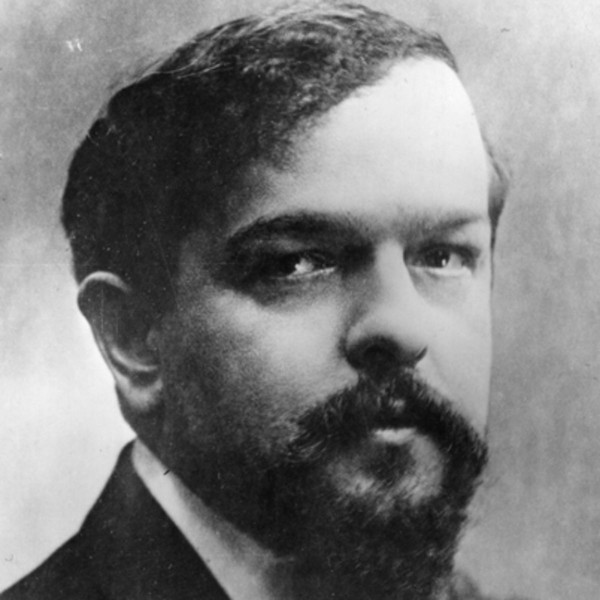

# Claude Debussy

## Artist Profile

Born: August 22, 1862 (Saint-Germain-en-Laye, France).
Died: March 25, 1918 (Paris, France).

Claude Debussy was a French composer. He is sometimes seen as the first Impressionist composer, although he vigorously rejected the term. He was among the most influential composers of the late 19th and early 20th centuries.
Debussy's music frees itself of the academicism of the late nineteenth century (in particular that of the Austro / German School) to offer new perspectives and dimensions to twentieth century music.
Through the use of pentatonic scales, of the whole tone scale, he returns to the ambiguity of modal systems and accomplishes a revolution of traditional harmony, different from the Wagnerian revolution.
Debussy's music frees itself from the tyranny of the bar, which with its periodic accents forces the rhythm to a pre-ordered repetitions; as a consequence of these metric-harmonic innovations the classical forms are abandoned.

## Artist Links

- [https://en.wikipedia.org/wiki/Claude_Debussy](https://en.wikipedia.org/wiki/Claude_Debussy)
- [https://www.jochenscheytt.de/debussy.html](https://www.jochenscheytt.de/debussy.html)
- [https://www.famouscomposers.net/claude-debussy](https://www.famouscomposers.net/claude-debussy)
- [https://www.britannica.com/biography/Claude-Debussy](https://www.britannica.com/biography/Claude-Debussy)
- [https://www.treccani.it/enciclopedia/claude-achille-debussy/](https://www.treccani.it/enciclopedia/claude-achille-debussy/)

## See also

- [La Mer · Prélude À L'Après-Midi D'Un Faune / Daphnis Et Chloé, Suite N° 2](La_Mer_·_Prélude_À_LAprès-Midi_DUn_Faune_-_Daphnis_Et_Chloé__Suite_N°_2.md)
