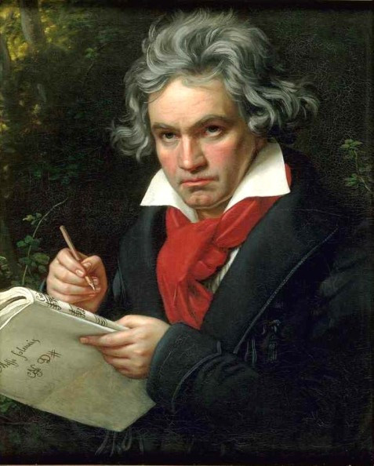

# Ludwig van Beethoven

## Artist Profile

German composer and pianist, born in 1770 (baptized 17 December 1770) in Bonn, Germany and died 26 March 1827 in Vienna, Austria.
A crucial figure in the transition between the Classical and Romantic eras in classical music. Beethoven led Viennese Classicism to its highest development and paved the way for Romantic music. 

Beethoven was the eldest son of a singer in the Kapelle of the Archbishop-Elector of Cologne and grandson of the Archbishop's Kapellmeister. He moved in 1792 to Vienna, where he had some lessons from Haydn and others, quickly establishing himself as a remarkable keyboard-player and original composer. By 1815 increasing deafness made public performance impossible and accentuated existing eccentricities of character, patiently tolerated by a series of rich patrons and his royal pupil the Archduke Rudolph.

Beethoven did much to enlarge the possibilities of music and widen the horizons of later generations of composers. To his contemporaries he was sometimes a controversial figure, making heavy demands on listeners both by the length and by the complexity of his writing, as he explored new fields of music.

## Artist Links

- [https://www.beethoven.de/](https://www.beethoven.de/)
- [http://www.lvbeethoven.com/](http://www.lvbeethoven.com/)
- [https://en.wikipedia.org/wiki/Ludwig_van_Beethoven](https://en.wikipedia.org/wiki/Ludwig_van_Beethoven)
- [https://www.klassika.info/Komponisten/Beethoven/](https://www.klassika.info/Komponisten/Beethoven/)
- [https://www.britannica.com/biography/Ludwig-van-Beethoven](https://www.britannica.com/biography/Ludwig-van-Beethoven)

## See also

- [9 Symphonien](9_Symphonien.md)
